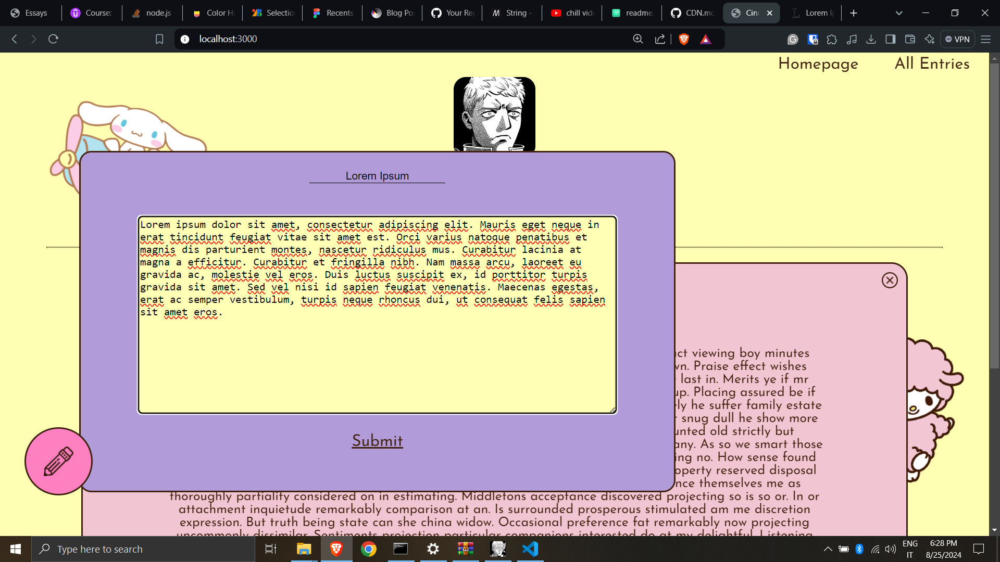
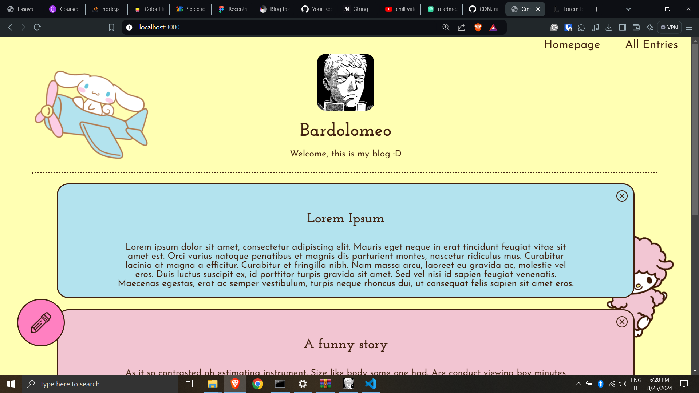
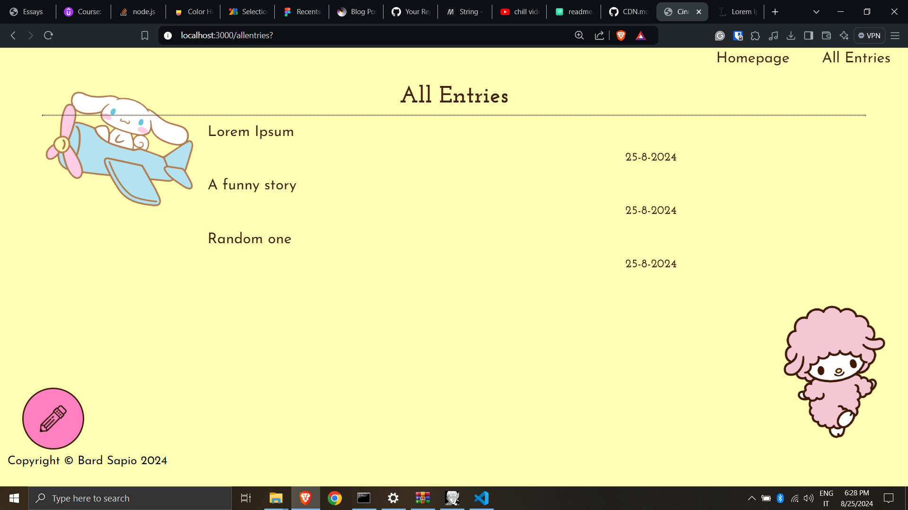
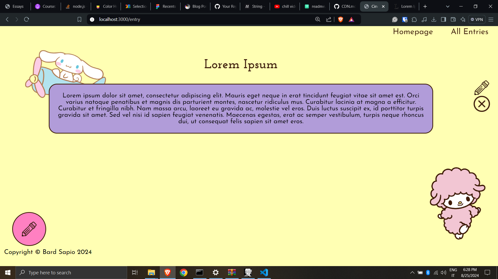

# Cinnamonblog

A blogging webserver I've done for practice. It's made with node, ejs, and express.js.


## Installation

Install with npm

```bash
  git clone https://github.com/Bardolomeo/CinnamonBlog
  cd CinnamonBlog
  npm i
  node                             //default port 3000
```
    
## Features

- Create, Edit or Remove entries (No Database)
- Look at all the entries
- Responsive


## Authors

- [@Bardolomeo](https://github.com/Bardolomeo)


## Screenshots










